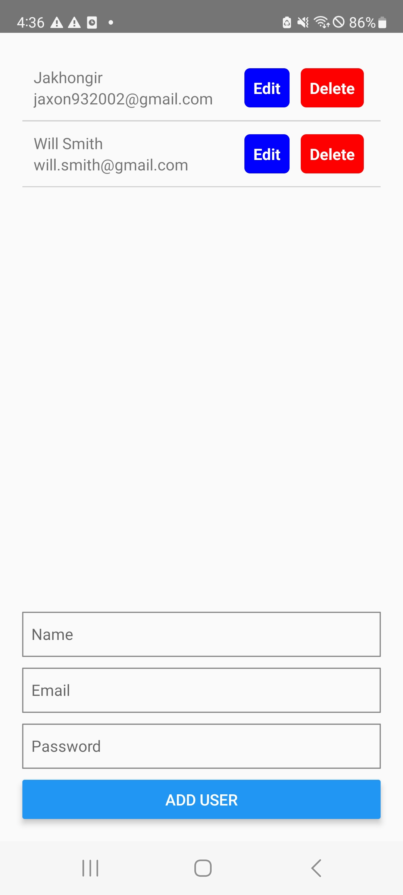

# Project Name

This is the README file for the project "real-app". It provides an overview of the project and instructions on how to set it up and run it.

## Table of Contents

- [Description](#description)
- [Installation](#installation)

## Description

This app is developed for studying MYSQL2 and Nodejs express.

## Installation

Clone the project.
Go to realapp-backend folder then run node server.js for running backend of the app. Make sure change BASE_URL to your IP address. (const BASE_URL = '{Your IP Address}:3000';)
Go to RealApp folder and "run npm run android".

